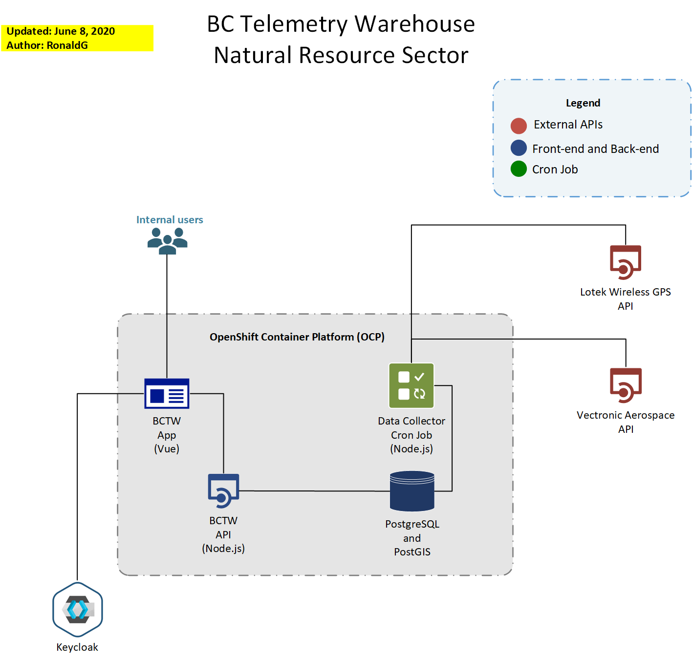
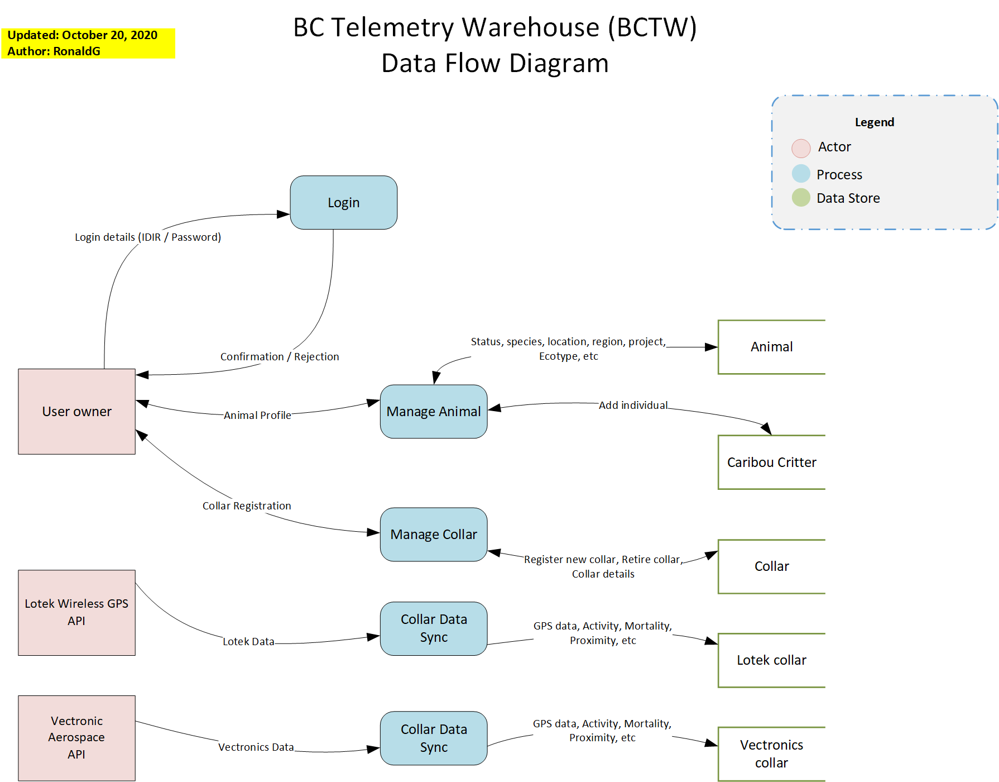

# BC Telemetry Warehouse (BCTW): Collar API

Code to support the aggregation of telemetry information from Vectronic Aerospace and Lotek wireless GPS collars.

## BCTW Architecture Overview ##

## BCTW Data Flow ##

## Running BCTW-API ##

See `DEV_SETUP_2022.md`.

## OpenShift ##

OpenShift details including build, deployment and pipelines are in the [openshift](openshift/README.md) folder.
